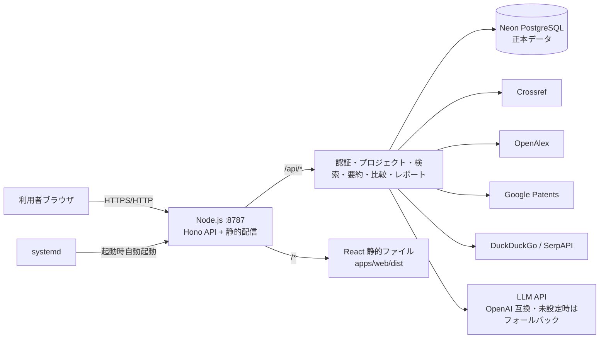
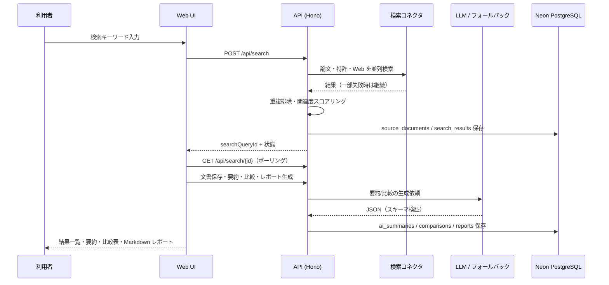

# International Civil Research & Patent Scout（ICRPS）

国際土木技術・論文・特許リサーチ支援システム。国内外の土木技術、工法、材料、特許、論文を横断検索し、AI 要約・比較表・調査レポートの生成までを支援します。

> ⚠️ 本システムの AI 要約・比較結果は、公開情報に基づく調査支援情報です。特許の権利判断、設計判断、施工可否、安全性判断を保証するものではありません。重要な判断には、原典確認および専門家確認を行ってください。

## 📊 デプロイ状況

| 項目 | 状態 |
| --- | --- |
| 本番 URL | `http://192.168.0.185:8787`（自動割当 IP + ポート、0.0.0.0 バインド） |
| 稼働方式 | Node.js + systemd（`icrps.service`、起動時自動起動・異常時自動再起動） |
| データベース | Neon PostgreSQL（プロジェクト: `International-Civil-Research-Patent-Scout` / `green-dawn-58312822`、aws-ap-southeast-1） |
| Cloudflare ドメイン | `mirai-dx-platform.com`（**サブドメインは後日決定**。承認まで DNS 変更なし） |
| サブドメイン候補 | `patent-scout.mirai-dx-platform.com` / `icrps.mirai-dx-platform.com` / `research-patent-scout.mirai-dx-platform.com` / `civil-research-patent-scout.mirai-dx-platform.com` |
| バージョン | v0.1.1（リリース直前準備版 / MVP は 2026-07-31 ローカル運用開始） |

## 🏗️ アーキテクチャ



## 🔄 データフロー



## 🧰 技術スタック

| レイヤー | 技術 |
| --- | --- |
| フロントエンド | React 19 + Vite 7 + TypeScript + react-router 8 |
| WebUI デザイン | [ICRPS WebUI (standalone).html](ICRPS%20WebUI%20(standalone).html) に 100% 準拠（サイドバー型 11 画面） |
| API | Hono 4（Cloudflare Workers 互換・Node.js 両対応） |
| DB | Neon PostgreSQL 17（`@neondatabase/serverless`） |
| 認証 | bcryptjs + JWT（jose / HS256） |
| AI | OpenAI 互換 API（未設定時はルールベースフォールバック） |
| テスト | Vitest 3 |
| CI/CD | GitHub Actions（将来の Cloudflare デプロイ用） |
| 運用 | systemd（`icrps.service`）+ スモークテスト |
| 監視 | systemd timer による 5 分間隔ヘルスチェック（失敗時自動再起動） |

## 📁 リポジトリ構成

```
apps/
  api/        Cloudflare Workers / Node.js API（Hono）
  web/        React Web UI
packages/
  contracts/  共有型定義
db/
  migrations/ SQL マイグレーション
deploy/
  systemd/    systemd unit テンプレート
  install-local.sh  ローカルデプロイスクリプト
docs/
  operations/ 運用・障害・監視・バックアップ手順
  release-notes/
scripts/      migrate / smoke テスト
```

## 🖥️ 画面一覧

| 画面 | URL | 概要 |
| --- | --- | --- |
| ログイン / 新規登録 | `/login` `/register` | メール+パスワード認証 |
| ダッシュボード | `/dashboard` | 統計・最近のプロジェクト/レポート |
| 横断検索 | `/search` | 論文・特許・Web の横断検索、保存、比較追加 |
| 文書詳細 | `/documents/:id` | メタデータ・AI 要約・引用 |
| プロジェクト | `/projects/:id` | 保存文献・タグ・メモ・比較/レポート導線 |
| 比較表 | `/projects/:id/comparison` | 比較軸ごとの比較表 |
| レポート生成 | `/projects/:id/reports/new` | 5 テンプレートから Markdown 生成 |
| レポート | `/reports/:id` | Markdown 表示・ダウンロード |
| 管理 | `/admin` | ユーザー管理・監査ログ（admin のみ） |

## 🔌 API 概要

| メソッド | パス | 説明 |
| --- | --- | --- |
| GET | `/api/health` | ヘルスチェック |
| POST | `/api/auth/register` `/api/auth/login` | 登録・ログイン |
| GET | `/api/auth/me` | 現在のユーザー |
| GET/POST | `/api/projects` | プロジェクト一覧・作成 |
| GET/PATCH/DELETE | `/api/projects/:id` | 詳細・更新・アーカイブ |
| POST | `/api/search` | 横断検索の実行 |
| GET | `/api/search/:id` | 検索状態と結果 |
| GET | `/api/documents/:id` | 文書詳細 |
| POST | `/api/documents/:id/summarize` | AI 要約 |
| POST | `/api/projects/:id/documents` | 文書保存 |
| POST | `/api/projects/:id/comparisons` | 比較表生成 |
| GET/PATCH | `/api/comparisons/:id` | 比較表取得・編集 |
| POST | `/api/projects/:id/reports` | レポート生成 |
| GET/POST | `/api/reports/:id` `/export` | レポート取得・Markdown エクスポート |
| GET | `/api/dashboard/stats` | ダッシュボード統計 |
| GET/PATCH | `/api/admin/users` | ユーザー管理（admin） |

詳細は [docs/api.md](docs/api.md) を参照。

## 🚀 ローカル開発

```bash
npm install
npm run typecheck && npm run lint && npm run test && npm run build
npm run dev:api   # API（Node 版: npm run serve -w @icrps/api）
npm run dev:web   # Web UI（Vite, http://localhost:5173）
```

ローカル実行に必要な環境変数は [.env.example](.env.example) と `apps/api/.dev.vars.example` を参照。

## 🏭 本番デプロイ（ローカル systemd）

```bash
sudo DATABASE_URL=postgresql://... ./deploy/install-local.sh
systemctl status icrps
curl http://127.0.0.1:8787/api/health
```

詳細は [docs/operations/deploy-runbook.md](docs/operations/deploy-runbook.md) を参照。

## 🛡️ セキュリティ

- パスワードは bcrypt でハッシュ化、JWT は HS256 + 12 時間期限
- 全データ操作に所有者チェック、admin 専用ルートはロールチェック
- 操作ログ（監査ログ）を記録
- セキュリティヘッダー（CSP・X-Frame-Options 等）を API レスポンスに付与
- 秘密情報（DATABASE_URL・JWT_SECRET・API キー）はリポジトリに置かず、`/etc/icrps/icrps.env`（0600）または GitHub Secrets で管理
- 依存関係監査: `npm audit`（現在 0 vulnerabilities）

## 📚 ドキュメント

- [要件定義書 PDF](要件定義International_Civil_Research__Patent_Scout.pdf) / [詳細設計書 PDF](詳細設計仕様書International_Civil_Research__Patent_Scout.pdf)
- [要件概要](docs/requirements.md) / [設計概要](docs/design.md)
- [API 仕様](docs/api.md) / [アーキテクチャ](docs/architecture.md)
- [デプロイ手順](docs/operations/deploy-runbook.md) / [障害対応](docs/operations/rollback.md)
- [監視手順](docs/operations/monitoring.md) / [バックアップ・リストア](docs/operations/backup-restore.md)
- [リリースノート](docs/release-notes/v0.1.0.md)
