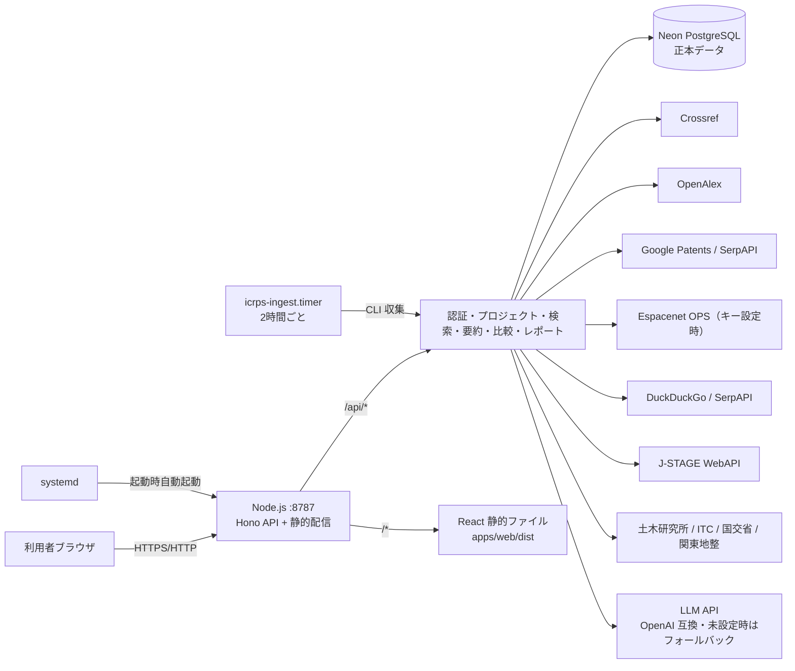
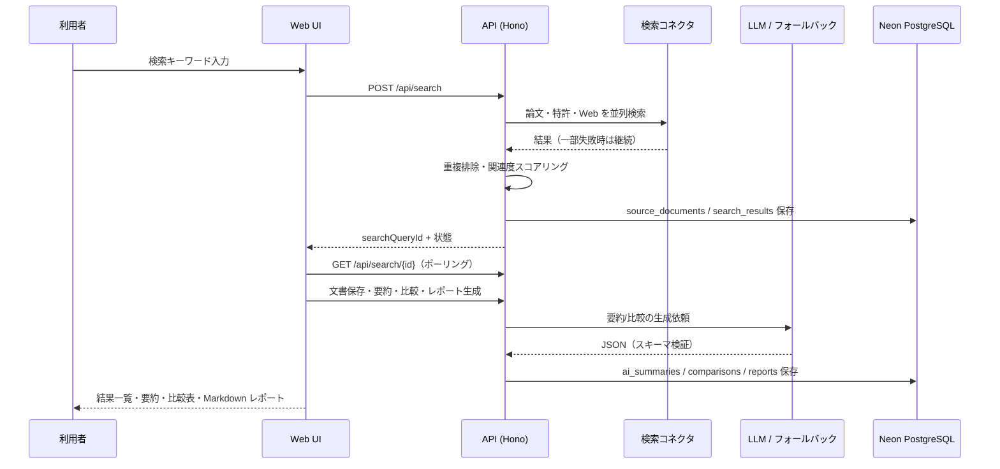

# International Civil Research & Patent Scout（ICRPS）

国際土木技術・論文・特許リサーチ支援システム。国内外の土木技術、工法、材料、特許、論文を横断検索し、AI 要約・比較表・調査レポートの生成までを支援します。

> ⚠️ 本システムの AI 要約・比較結果は、公開情報に基づく調査支援情報です。特許の権利判断、設計判断、施工可否、安全性判断を保証するものではありません。重要な判断には、原典確認および専門家確認を行ってください。

## 📊 デプロイ状況

| 項目 | 状態 |
| --- | --- |
| 本番 URL | `https://icrps.mirai-dx-platform.com`（Cloudflare Workers・HTTPS）／ フォールバック: `http://192.168.0.185:8787` |
| 稼働方式 | Node.js + systemd（`icrps.service`、起動時自動起動・異常時自動再起動） |
| 文献データ連携 | systemd timer（`icrps-ingest.timer`）による **2時間ごとの自動収集**（J-STAGE / 土木研究所 / ITC / 国交省 / 関東地整） |
| 更新監視（ウォッチ） | systemd timer（`icrps-watch.timer`）による **2時間ごとの新着検知＋アプリ内通知** |
| データベース | Neon PostgreSQL（プロジェクト: `International-Civil-Research-Patent-Scout` / `green-dawn-58312822`、aws-ap-southeast-1） |
| Cloudflare ドメイン | `icrps.mirai-dx-platform.com`（**稼働中** 2026-08-01。手順: [domain-migration.md](docs/operations/domain-migration.md)） |
| サブドメイン候補 | `patent-scout.mirai-dx-platform.com` / `icrps.mirai-dx-platform.com` / `research-patent-scout.mirai-dx-platform.com` / `civil-research-patent-scout.mirai-dx-platform.com` |
| バージョン | v0.9.0（2026-08-05 ローカル本番適用済み／Cloudflare は v0.1.1 のまま） |

## 🏗️ アーキテクチャ



## 📚 土木建設技術文献データ連携

土木建設分野の技術文献・論文・技術情報を、指定情報源から **2時間ごとに自動取得** して `source_documents` へ蓄積します（メタデータのみ・本文/PDF は保存しません）。

| 情報源 | 取得方式 | 状態 |
| --- | --- | --- |
| J-STAGE（土木学会論文集・構造工学論文集等） | 公式 WebAPI（Atom/OpenSearch） | ✅ 稼働 |
| 土木研究所 論文・刊行物検索（thesis.pwri.go.jp） | 新着一覧 HTML パース | ✅ 稼働 |
| ITC Digital Library（itc.scix.net） | 年別一覧＋詳細ページ（増分・上限100件/回） | ✅ 稼働 |
| 国土交通省 技術調査（mlit.go.jp/tec） | 記事リンク抽出 | ✅ 稼働 |
| 関東地方整備局 技術情報（ktr.mlit.go.jp） | 記事リンク抽出 | ✅ 稼働 |
| PATENTSCOPE / J-PlatPat | （自動取得対象外・後日手動取り込みUIを検討） | ⏸ 保留 |

- 実行基盤: `icrps-ingest.timer`（cron 相当・2時間ごと・`RandomizedDelaySec=90`）
- 手動実行: `systemctl start icrps-ingest.service`、または管理画面「システム設定 → 文献データ連携 → 今すぐ取得」
- 実行履歴は監査ログ（`ingest.run`）に記録され、管理画面に表示されます
- 詳細: [docs/operations/literature-ingest.md](docs/operations/literature-ingest.md)

## 🔄 データフロー



## 🧰 技術スタック

| レイヤー | 技術 |
| --- | --- |
| フロントエンド | React 19 + Vite 7 + TypeScript + react-router 8 |
| WebUI デザイン | [ICRPS WebUI (standalone).html](ICRPS%20WebUI%20(standalone).html) に 100% 準拠（サイドバー型 11 画面） |
| API | Hono 4（Cloudflare Workers 互換・Node.js 両対応） |
| DB | Neon PostgreSQL 17（`@neondatabase/serverless`） |
| 認証 | bcryptjs + JWT（jose / HS256） |
| AI | OpenAI 互換 API（未設定時はルールベースフォールバック） |
| テスト | Vitest 3 |
| CI/CD | GitHub Actions（将来の Cloudflare デプロイ用） |
| 運用 | systemd（`icrps.service`）+ スモークテスト |
| 監視 | systemd timer による 5 分間隔ヘルスチェック（失敗時自動再起動） |

## 📁 リポジトリ構成

```
apps/
  api/        Cloudflare Workers / Node.js API（Hono）
  web/        React Web UI
packages/
  contracts/  共有型定義
db/
  migrations/ SQL マイグレーション
deploy/
  systemd/    systemd unit テンプレート
  install-local.sh  ローカルデプロイスクリプト
docs/
  operations/ 運用・障害・監視・バックアップ手順
  release-notes/
scripts/      migrate / smoke テスト
```

## 🖥️ 画面一覧

| 画面 | URL | 概要 |
| --- | --- | --- |
| ログイン / 新規登録 | `/login` `/register` | メール+パスワード認証 |
| ダッシュボード | `/dashboard` | 統計・最近のプロジェクト/レポート |
| 技術文献フィード | `/feed` | 保存文献に加え、**収集文献（土木建設技術）** をタブ表示（J-STAGE / 土木研究所 / ITC / 国交省 / 関東地整の自動収集分を情報源・キーワードで絞り込み、詳細カードで閲覧） |
| 横断検索 | `/search` | 論文・特許・Web の横断検索、保存、比較追加 |
| 文書詳細 | `/documents/:id` | メタデータ・AI 要約・引用 |
| プロジェクト | `/projects/:id` | 保存文献・タグ・メモ・比較/レポート導線 |
| 比較表 | `/projects/:id/comparison` | 比較軸ごとの比較表 |
| レポート生成 | `/projects/:id/reports/new` | 5 テンプレートから Markdown 生成 |
| レポート | `/reports/:id` | Markdown 表示・ダウンロード |
| 更新監視 | `/watch` | ウォッチテーマの登録・有効/停止・**新着通知の確認・今すぐ監視** |
| 管理 | `/admin` | ユーザー管理・監査ログ（admin のみ） |
| システム設定 | `/settings` | パスワード変更＋ AI プロバイダ設定（DeepSeek / Anthropic のキー・テスト・保存・クリア）＋ 文献データ連携（取得履歴・今すぐ取得） |

## 🔌 API 概要

| メソッド | パス | 説明 |
| --- | --- | --- |
| GET | `/api/health` | ヘルスチェック |
| POST | `/api/auth/register` `/api/auth/login` | 登録・ログイン |
| GET | `/api/auth/me` | 現在のユーザー |
| POST | `/api/auth/forgot-password` `/reset-password` | パスワードリセット |
| POST | `/api/auth/magic-link` `/verify` | マジックリンクログイン |
| GET | `/api/auth/sso` `/sso/google/url` | Google SSO |
| GET/POST | `/api/projects` | プロジェクト一覧・作成 |
| GET/PATCH/DELETE | `/api/projects/:id` | 詳細・更新・アーカイブ |
| GET/POST | `/api/projects/:id/members` | メンバー一覧・追加 |
| PATCH/DELETE | `/api/projects/:id/members/:userId` | メンバーのロール変更・削除 |
| POST | `/api/projects/:id/transfer` | オーナー移譲 |
| POST | `/api/projects/:id/team` | チーム割当 |
| GET/POST | `/api/teams` | チーム一覧・作成 |
| GET/POST | `/api/teams/:id/members` | チームメンバー一覧・追加 |
| PATCH/DELETE | `/api/teams/:id/members/:userId` | チームメンバーのロール変更・削除 |
| POST | `/api/search` | 横断検索の実行 |
| GET | `/api/search/:id` | 検索状態と結果 |
| GET | `/api/search/history` | 検索履歴 |
| GET | `/api/search/bookmarks` | ブックマーク済み検索 |
| PATCH | `/api/search/:id/bookmark` | 検索履歴のブックマーク登録/解除 |
| GET | `/api/documents/:id` | 文書詳細 |
| GET | `/api/documents/:id/similar` | 類似文献検索 |
| GET | `/api/documents/:id/citations` | 引用・被引用情報（Cited-by） |
| GET | `/api/documents/:id/patent-family` | 特許ファミリー（INPADOC / DB 候補） |
| POST | `/api/documents/:id/summarize` | AI 要約 |
| POST | `/api/documents/import` | 手動文献登録（特許・論文・Web・PDF） |
| POST | `/api/projects/:id/documents` | 文書保存 |
| POST | `/api/projects/:id/comparisons` | 比較表生成 |
| GET/PATCH | `/api/comparisons/:id` | 比較表取得・編集 |
| POST | `/api/projects/:id/reports` | レポート生成 |
| GET/POST | `/api/reports/:id` `/export` | レポート取得・Markdown エクスポート |
| POST | `/api/auth/change-password` | パスワード変更 |
| GET | `/api/notifications` `/unread-count` | 通知一覧・未読件数 |
| POST | `/api/notifications/:id/read` `/read-all` | 通知の既読化 |
| POST | `/api/watch/run` | 更新監視の手動実行 |
| GET | `/api/dashboard/stats` | ダッシュボード統計 |
| GET | `/api/literature` | 収集文献一覧（情報源・キーワード・ページング。認証必須） |
| GET/PATCH | `/api/admin/users` | ユーザー管理（admin） |
| GET | `/api/admin/ingest/runs` | 文献収集の実行履歴（admin） |
| POST | `/api/admin/ingest/run` | 文献収集を手動実行（admin） |
| POST | `/api/admin/search/reindex` | Meilisearch 再インデックス（admin） |
| GET | `/api/admin/stats` | システム統計（admin） |
| GET | `/api/admin/usage` | LLM 使用量（admin） |
| GET | `/api/teams/:id/stats` | チーム統計 |

詳細は [docs/api.md](docs/api.md) を参照。

## 🚀 ローカル開発

```bash
npm install
npm run typecheck && npm run lint && npm run test && npm run build
npm run dev:api   # API（Node 版: npm run serve -w @icrps/api）
npm run dev:web   # Web UI（Vite, http://localhost:5173）
```

ローカル実行に必要な環境変数は [.env.example](.env.example) と `apps/api/.dev.vars.example` を参照。

## 🏭 本番デプロイ（ローカル systemd）

```bash
sudo DATABASE_URL=postgresql://... ./deploy/install-local.sh
systemctl status icrps
curl http://127.0.0.1:8787/api/health
```

詳細は [docs/operations/deploy-runbook.md](docs/operations/deploy-runbook.md) を参照。

## 🛡️ セキュリティ

- パスワードは bcrypt でハッシュ化、JWT は HS256 + 12 時間期限
- 全データ操作に所有者チェック、admin 専用ルートはロールチェック
- 操作ログ（監査ログ）を記録
- セキュリティヘッダー（CSP・X-Frame-Options 等）を API レスポンスに付与
- 秘密情報（DATABASE_URL・JWT_SECRET・API キー）はリポジトリに置かず、`/etc/icrps/icrps.env`（0600）または GitHub Secrets で管理
- 依存関係監査: `npm audit`（現在 0 vulnerabilities）

## 📚 ドキュメント

- [要件定義書 PDF](要件定義International_Civil_Research__Patent_Scout.pdf) / [詳細設計書 PDF](詳細設計仕様書International_Civil_Research__Patent_Scout.pdf)
- [要件概要](docs/requirements.md) / [設計概要](docs/design.md)
- [API 仕様](docs/api.md) / [アーキテクチャ](docs/architecture.md)
- [デプロイ手順](docs/operations/deploy-runbook.md) / [障害対応](docs/operations/rollback.md)
- [監視手順](docs/operations/monitoring.md) / [バックアップ・リストア](docs/operations/backup-restore.md)
- [インシデント対応 Runbook](docs/operations/runbook.md) / [SLO・アラート](docs/operations/slo-alerts.md)
- [運用台帳](docs/operations/ops-ledger.md) / [セキュリティ・保守手順](docs/operations/security-maintenance.md)
- [文献データ連携の運用](docs/operations/literature-ingest.md)
- [更新監視（ウォッチ）の運用](docs/operations/watch-monitoring.md)
- [リリースノート](docs/release-notes/v0.1.0.md) / [v0.1.1](docs/release-notes/v0.1.1.md) / [v0.1.2](docs/release-notes/v0.1.2.md) / [v0.2.0](docs/release-notes/v0.2.0.md) / [v0.3.0](docs/release-notes/v0.3.0.md) / [v0.4.0](docs/release-notes/v0.4.0.md) / [v0.5.0](docs/release-notes/v0.5.0.md) / [v0.6.0](docs/release-notes/v0.6.0.md) / [v0.7.0](docs/release-notes/v0.7.0.md) / [v0.8.0](docs/release-notes/v0.8.0.md) / [v0.9.0](docs/release-notes/v0.9.0.md)
