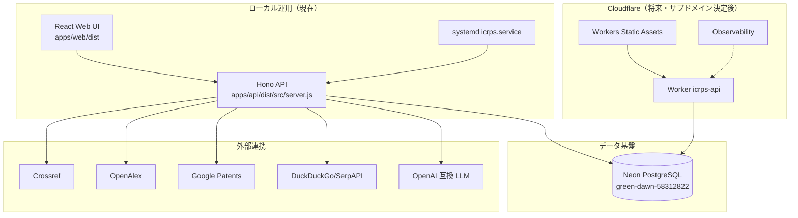
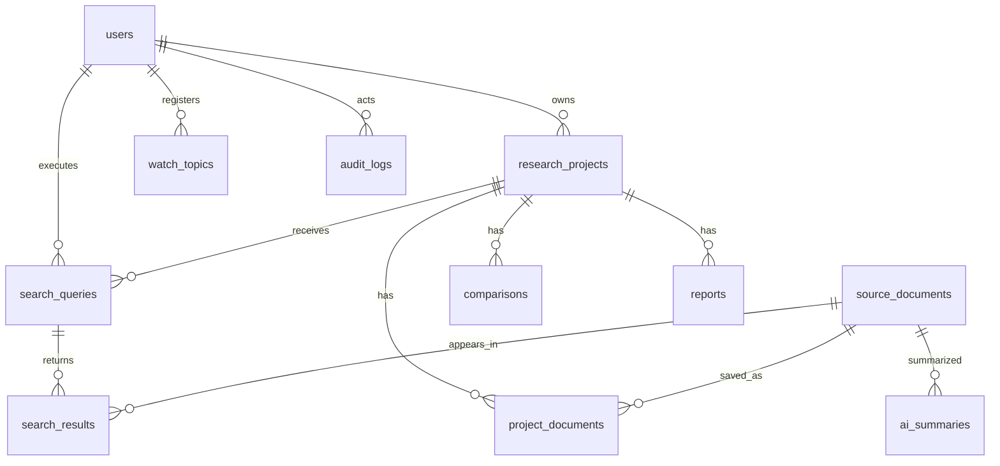

# アーキテクチャ

## 全体構成

## 設計原則

- **コネクタ方式**: 検索ソースは `SearchConnector` インターフェースで抽象化
- **フォールバック**: LLM API キー未設定・外部 API 障害時でも、辞書ベースのキーワード展開・メタデータベースの要約で MVP 機能を維持
- **同一オリジン**: API と Web を同一プロセス/ドメインで配信し、CORS 不要・シークレットのフロント公開なし
- **正本は Neon**: 業務データは PostgreSQL のみ。接続情報は `/etc/icrps/icrps.env`（0600）または Cloudflare Secrets / GitHub Secrets
- **監査**: ログイン・検索・保存・要約・比較・レポート生成・エクスポートを `audit_logs` に記録

## データベース ER（概要）

## 主要テーブル

| テーブル | 用途 |
| --- | --- |
| users | 認証・ロール |
| research_projects | 調査テーマ・タグ・ステータス |
| search_queries | 検索条件・展開語・状態・失敗ソース |
| source_documents | 取得文書メタデータ（本文は原則保存しない） |
| search_results | 検索と文書の関連（rank・スコア） |
| project_documents | プロジェクトへの保存（タグ・重要度・メモ） |
| ai_summaries | 要約・分類・引用 |
| comparisons | 比較軸・行データ |
| reports | Markdown レポート |
| watch_topics | 更新監視（将来） |
| audit_logs | 操作監査 |
